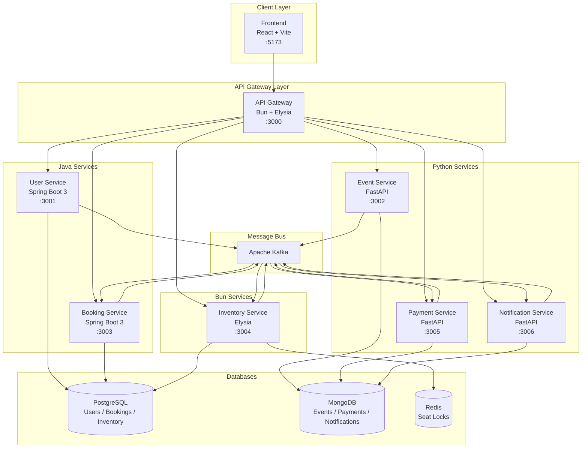
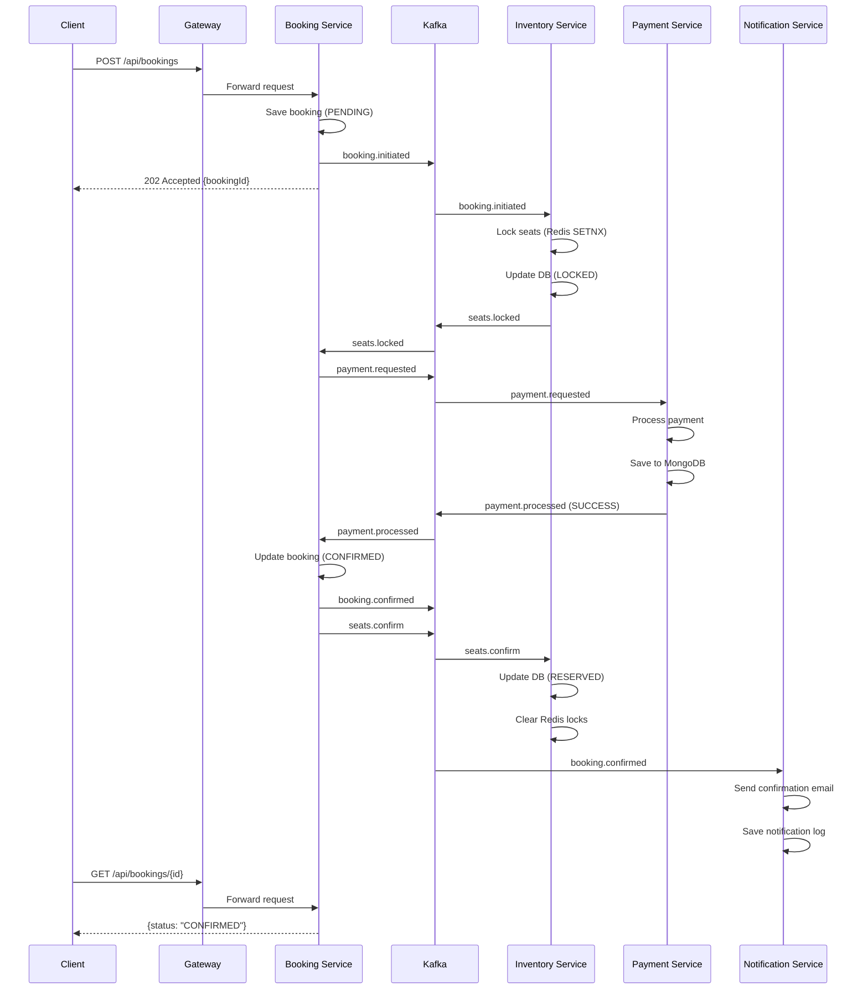

# TicketFlow — Polyglot Microservice Architecture


> A distributed event ticket booking platform demonstrating polyglot microservice architecture with event-driven choreography saga.

---

## Table of Contents

- [What is TicketFlow?](#what-is-ticketflow)
- [Architecture Overview](#architecture-overview)
- [Booking Saga Flow](#booking-saga-flow)
- [Tech Stack](#tech-stack)
- [Project Structure](#project-structure)
- [Quick Start](#quick-start)
- [API Reference Summary](#api-reference-summary)
- [Environment Variables](#environment-variables)
- [Development Tools](#development-tools)
- [Kafka Topics](#kafka-topics)
- [Why Polyglot?](#why-polyglot)
- [Why Kafka over RabbitMQ?](#why-kafka-over-rabbitmq)
- [Contributing](#contributing)
- [License](#license)

---

## What is TicketFlow?

TicketFlow is a production-grade reference implementation of a **polyglot microservice platform** for selling and managing event tickets. It is designed to demonstrate:

- **Polyglot architecture** — each service uses the runtime and framework best suited to its workload (Java Spring Boot for transactional services, Python FastAPI for document-centric services, and Bun/Elysia for high-throughput edge logic).
- **Event-driven choreography saga** — the entire booking lifecycle (seat locking, payment processing, confirmation) is coordinated asynchronously through Apache Kafka with no central orchestrator.
- **Database-per-service** — every service owns and manages its own datastore; no shared databases, no cross-service SQL joins.
- **Production-ready observability** — Prometheus metrics, Grafana dashboards, Jaeger distributed tracing, and Loki log aggregation are included out of the box.
- **Cloud-native scalability** — Kubernetes manifests with KEDA-based autoscaling that reacts to Kafka consumer lag, allowing each service to scale independently under load.

Whether you are exploring microservice design patterns, evaluating polyglot technology choices, or using TicketFlow as a scaffold for a real ticketing product, this repository provides a complete, runnable reference.

---

## Architecture Overview



All client requests enter through the **API Gateway** (Bun + Elysia), which handles JWT validation, route proxying, and request logging. For reads and simple commands the gateway forwards directly to the target service over HTTP. For the booking lifecycle the gateway accepts the initial request and returns `202 Accepted`; the client then polls for the result while the saga progresses asynchronously via Kafka.

---

## Booking Saga Flow

The booking lifecycle is the centrepiece of TicketFlow's event-driven design. No service calls another service directly; every step is triggered by a Kafka event.



### Saga Compensation (Failure Path)

If any step fails the saga runs compensating transactions in reverse:

| Failure Point | Compensating Event | Compensating Action |
|---|---|---|
| Seat lock fails | `seats.lock-failed` | Booking Service marks booking FAILED |
| Payment fails | `payment.processed` (FAILED) | Inventory releases locks via `seats.release` |
| Booking Service crash | Kafka retry / DLT | Message replayed on restart |

---

## Tech Stack

| Service | Language | Runtime | Framework | Database | Kafka Role | Port |
|---|---|---|---|---|---|---|
| API Gateway | TypeScript | Bun 1.1 | Elysia | — | — | 3000 |
| User Service | Java | JDK 21 | Spring Boot 3 | PostgreSQL | Producer | 3001 |
| Event Service | Python | CPython 3.12 | FastAPI | MongoDB | Producer | 3002 |
| Booking Service | Java | JDK 21 | Spring Boot 3 | PostgreSQL | Producer + Consumer | 3003 |
| Inventory Service | TypeScript | Bun 1.1 | Elysia | PostgreSQL + Redis | Producer + Consumer | 3004 |
| Payment Service | Python | CPython 3.12 | FastAPI | MongoDB | Producer + Consumer | 3005 |
| Notification Service | Python | CPython 3.12 | FastAPI | MongoDB | Consumer | 3006 |
| Frontend | TypeScript | Node 20 | React 18 + Vite | — | — | 5173 |

### Infrastructure

| Component | Technology | Purpose |
|---|---|---|
| Message Broker | Apache Kafka | Async inter-service communication |
| Relational DB | PostgreSQL 16 | Users, bookings, seat inventory |
| Document DB | MongoDB 7 | Events, payments, notifications |
| Cache / Lock | Redis 7 | Distributed seat locking, TTL-based |
| Observability | Prometheus + Grafana | Metrics and dashboards |
| Tracing | Jaeger + OpenTelemetry | Distributed trace correlation |
| Log Aggregation | Loki + Promtail | Centralised log storage and search |
| Local Email | Mailpit | Captures outbound email in dev |
| Kafka UI | Redpanda Console | Browse topics and messages |
| Mongo UI | Mongo Express | Browse MongoDB collections |

---

## Project Structure

```
ticketflow/
├── README.md
├── Makefile                        # Developer shortcuts
├── docker-compose.yml              # Full dev stack
├── docker-compose.prod.yml         # Production overrides
├── .env.example                    # Template environment file
│
├── gateway/                        # API Gateway (Bun + Elysia)
│   ├── src/
│   │   ├── index.ts
│   │   ├── routes/
│   │   ├── middleware/
│   │   └── config.ts
│   ├── package.json
│   ├── tsconfig.json
│   └── Dockerfile
│
├── services/
│   ├── user-service/               # Java + Spring Boot 3
│   │   ├── src/main/java/
│   │   ├── src/main/resources/
│   │   ├── pom.xml
│   │   └── Dockerfile
│   │
│   ├── event-service/              # Python + FastAPI
│   │   ├── app/
│   │   │   ├── main.py
│   │   │   ├── routers/
│   │   │   ├── models/
│   │   │   └── kafka/
│   │   ├── requirements.txt
│   │   └── Dockerfile
│   │
│   ├── booking-service/            # Java + Spring Boot 3
│   │   ├── src/main/java/
│   │   ├── src/main/resources/
│   │   ├── pom.xml
│   │   └── Dockerfile
│   │
│   ├── inventory-service/          # Bun + Elysia
│   │   ├── src/
│   │   ├── package.json
│   │   └── Dockerfile
│   │
│   ├── payment-service/            # Python + FastAPI
│   │   ├── app/
│   │   ├── requirements.txt
│   │   └── Dockerfile
│   │
│   └── notification-service/       # Python + FastAPI
│       ├── app/
│       ├── requirements.txt
│       └── Dockerfile
│
├── frontend/                       # React 18 + Vite
│   ├── src/
│   ├── public/
│   ├── package.json
│   ├── vite.config.ts
│   └── Dockerfile
│
├── infra/
│   ├── kafka/
│   │   └── topics.sh               # Topic creation script
│   ├── postgres/
│   │   └── init.sql                # Schema initialisation
│   ├── mongo/
│   │   └── init.js                 # Collection + index setup
│   ├── prometheus/
│   │   └── prometheus.yml
│   ├── grafana/
│   │   └── dashboards/
│   ├── jaeger/
│   └── loki/
│
├── k8s/
│   ├── namespace.yaml
│   ├── secrets/
│   │   └── app-secrets.yaml.example
│   ├── gateway/
│   ├── services/
│   └── keda/
│       └── scaledobjects.yaml
│
├── scripts/
│   ├── seed.sh
│   ├── health-check.sh
│   └── e2e-booking.sh
│
└── docs/
    ├── architecture.md
    ├── development.md
    ├── deployment.md
    ├── event-catalog.md
    ├── api-reference.md
    ├── observability.md
    ├── adr/
    │   ├── 001-polyglot-architecture.md
    │   ├── 002-kafka-over-rabbitmq.md
    │   ├── 003-async-saga-pattern.md
    │   └── 004-database-per-service.md
    └── services/
        ├── gateway.md
        ├── user-service.md
        ├── event-service.md
        ├── booking-service.md
        ├── inventory-service.md
        ├── payment-service.md
        └── notification-service.md
```

---

## Quick Start

### Prerequisites

| Tool | Minimum Version | Install |
|---|---|---|
| Docker | 24.x | [docs.docker.com](https://docs.docker.com/get-docker/) |
| Docker Compose | 2.x | Bundled with Docker Desktop |
| Make | any | `brew install make` / `apt install make` |
| Bun | 1.1+ | `curl -fsSL https://bun.sh/install \| bash` |
| JDK | 21 | `sdk install java 21-graalce` |
| Python | 3.12 | `pyenv install 3.12` |

> **Note:** For Docker Compose development you only strictly need Docker + Make. The language runtimes are required only if you want to run individual services outside of containers.

### 1 — Clone and setup

```bash
git clone https://github.com/your-org/ticketflow.git
cd ticketflow

# Copy the example environment file and review/edit as needed
make setup
```

### 2 — Start infrastructure and all services

```bash
# Starts Kafka, databases, all microservices, and the frontend
make dev
```

This command:
1. Pulls or builds all Docker images.
2. Starts Zookeeper + Kafka and waits for the broker to be healthy.
3. Creates all Kafka topics via `infra/kafka/topics.sh`.
4. Starts PostgreSQL, MongoDB, and Redis; runs migrations and index creation.
5. Starts all eight application services.
6. Starts Prometheus, Grafana, Jaeger, Loki, Mailpit, and Redpanda Console.

### 3 — Seed sample data

```bash
# Creates sample venues, events, and a test user account
make seed
```

Credentials for the seeded test user:
- **Email:** `test@ticketflow.dev`
- **Password:** `Test1234!`

### 4 — Verify everything is running

```bash
make health
```

Expected output:

```
gateway           ✓  http://localhost:3000/health
user-service      ✓  http://localhost:3001/actuator/health
event-service     ✓  http://localhost:3002/health
booking-service   ✓  http://localhost:3003/actuator/health
inventory-service ✓  http://localhost:3004/health
payment-service   ✓  http://localhost:3005/health
notification-service ✓  http://localhost:3006/health
frontend          ✓  http://localhost:5173
```

### 5 — Run an end-to-end booking

```bash
# Guided script that registers a user, creates a booking, and polls for confirmation
make e2e
```

---

## API Reference Summary

All requests go through the gateway at `http://localhost:3000`. Protected routes require `Authorization: Bearer <token>`.

| Service | Method | Path | Auth | Description |
|---|---|---|---|---|
| Gateway | GET | `/health` | No | Gateway health check |
| User | POST | `/api/users/register` | No | Register a new user |
| User | POST | `/api/users/login` | No | Authenticate, receive JWT |
| User | GET | `/api/users/me` | Yes | Get current user profile |
| Event | GET | `/api/events` | No | List all upcoming events |
| Event | GET | `/api/events/:id` | No | Get event details |
| Event | POST | `/api/events` | Yes (admin) | Create a new event |
| Event | PUT | `/api/events/:id` | Yes (admin) | Update event |
| Event | POST | `/api/venues` | Yes (admin) | Create a venue |
| Event | GET | `/api/venues/:id` | No | Get venue details |
| Inventory | GET | `/api/inventory/events/:eventId/seats` | No | List seat availability |
| Booking | POST | `/api/bookings` | Yes | Initiate a booking (async) |
| Booking | GET | `/api/bookings/my` | Yes | List user's bookings |
| Booking | GET | `/api/bookings/:id` | Yes | Get booking status |
| Booking | POST | `/api/bookings/:id/cancel` | Yes | Cancel a booking |
| Payment | GET | `/api/payments/:id` | Yes | Get payment details |
| Payment | GET | `/api/payments/booking/:bookingId` | Yes | Get payment for booking |
| Notification | GET | `/api/notifications/recent` | Yes | Recent notifications |
| Notification | GET | `/api/notifications/health` | No | Notification service health |

Full request/response schemas and error codes are documented in [docs/api-reference.md](docs/api-reference.md).

---

## Environment Variables

The `.env.example` file contains all variables. Run `make setup` to copy it to `.env`.

| Variable | Description | Default | Required |
|---|---|---|---|
| `JWT_SECRET` | Secret key for JWT signing | — | Yes |
| `JWT_EXPIRY_HOURS` | Token lifetime in hours | `24` | No |
| `POSTGRES_USER` | PostgreSQL superuser | `ticketflow` | Yes |
| `POSTGRES_PASSWORD` | PostgreSQL password | — | Yes |
| `POSTGRES_DB` | Default database name | `ticketflow` | Yes |
| `MONGO_INITDB_ROOT_USERNAME` | MongoDB root user | `ticketflow` | Yes |
| `MONGO_INITDB_ROOT_PASSWORD` | MongoDB root password | — | Yes |
| `REDIS_PASSWORD` | Redis password | — | Yes |
| `KAFKA_BOOTSTRAP_SERVERS` | Kafka broker address | `kafka:9092` | Yes |
| `USER_SERVICE_URL` | Internal URL for user service | `http://user-service:3001` | Yes |
| `EVENT_SERVICE_URL` | Internal URL for event service | `http://event-service:3002` | Yes |
| `BOOKING_SERVICE_URL` | Internal URL for booking service | `http://booking-service:3003` | Yes |
| `INVENTORY_SERVICE_URL` | Internal URL for inventory service | `http://inventory-service:3004` | Yes |
| `PAYMENT_SERVICE_URL` | Internal URL for payment service | `http://payment-service:3005` | Yes |
| `NOTIFICATION_SERVICE_URL` | Internal URL for notification service | `http://notification-service:3006` | Yes |
| `SMTP_HOST` | SMTP server host | `mailpit` | Yes |
| `SMTP_PORT` | SMTP server port | `1025` | Yes |
| `EMAIL_FROM` | Sender address for notifications | `noreply@ticketflow.dev` | Yes |
| `STRIPE_SECRET_KEY` | Stripe API key (payment) | — | Yes |
| `STRIPE_WEBHOOK_SECRET` | Stripe webhook signing secret | — | Yes |
| `PROMETHEUS_ENABLED` | Enable Prometheus metrics | `true` | No |
| `OTEL_EXPORTER_JAEGER_ENDPOINT` | Jaeger collector endpoint | `http://jaeger:14268/api/traces` | No |
| `LOG_LEVEL` | Application log level | `info` | No |

---

## Development Tools

| Tool | URL | Description |
|---|---|---|
| API Gateway | http://localhost:3000 | Entry point for all API requests |
| Frontend | http://localhost:5173 | React application (Vite dev server) |
| Redpanda Console (Kafka UI) | http://localhost:8080 | Browse topics, consumer groups, messages |
| Mongo Express | http://localhost:8081 | Browse MongoDB collections |
| Mailpit | http://localhost:8025 | Captures all outbound email (dev only) |

---

## Kafka Topics

| Topic | Producer | Consumers | Purpose |
|---|---|---|---|
| `ticketflow.user.registered` | User Service | Notification Service | Welcome email trigger |
| `ticketflow.event.created` | Event Service | — | Event lifecycle event |
| `ticketflow.booking.initiated` | Booking Service | Inventory Service | Start seat lock step |
| `ticketflow.seats.locked` | Inventory Service | Booking Service | Proceed to payment step |
| `ticketflow.seats.lock-failed` | Inventory Service | Booking Service | Abort saga |
| `ticketflow.seats.confirm` | Booking Service | Inventory Service | Finalise seat reservation |
| `ticketflow.seats.release` | Booking Service / Payment Service | Inventory Service | Release seats on failure |
| `ticketflow.payment.requested` | Booking Service | Payment Service | Trigger payment processing |
| `ticketflow.payment.processed` | Payment Service | Booking Service | Payment result |
| `ticketflow.booking.confirmed` | Booking Service | Notification Service | Send confirmation email |
| `ticketflow.booking.failed` | Booking Service | Notification Service | Send failure notification |
| `ticketflow.booking.cancelled` | Booking Service | Notification Service, Inventory Service | Cancel flow |

Full payload schemas in [docs/event-catalog.md](docs/event-catalog.md).

---

## Why Polyglot?

Each technology was chosen to match the characteristics of its service.

| Service | Runtime | Rationale |
|---|---|---|
| API Gateway | Bun + Elysia | Extremely low startup time, high throughput for proxying. Bun's native fetch is faster than Node's for proxy workloads. |
| User Service | Java + Spring Boot 3 | Strong type safety, mature Spring Security for JWT, Spring Data JPA for transactional user management. Virtual threads (JDK 21) handle high concurrency. |
| Event Service | Python + FastAPI | Event data is document-centric and schema-flexible. FastAPI's automatic OpenAPI generation suits the read-heavy event catalog. |
| Booking Service | Java + Spring Boot 3 | Booking records require ACID guarantees. Spring Kafka integration supports exactly-once semantics. |
| Inventory Service | Bun + Elysia | Seat availability queries are extremely hot. Bun's performance on tight loops and Redis commands is competitive with Go for this workload. |
| Payment Service | Python + FastAPI | Payment provider SDKs (Stripe) have first-class Python support. Async FastAPI handles webhooks and background tasks naturally. |
| Notification Service | Python + FastAPI | Email templating (Jinja2) and SMTP are idiomatic in Python. Low-throughput service where iteration speed matters more than raw performance. |

---

## Why Kafka over RabbitMQ?

TicketFlow originally used RabbitMQ. The migration to Kafka was driven by:

1. **Event log replay** — Kafka retains messages for a configurable period. Services can replay missed events from their last committed offset on restart.
2. **Consumer groups** — Multiple instances of the same service share a consumer group and automatically partition work without additional coordination.
3. **KEDA integration** — KEDA's Kafka trigger scales pod replicas based on consumer lag.
4. **Partition-based ordering** — Booking events for the same `bookingId` are routed to the same partition, guaranteeing ordered processing per booking.
5. **Saga auditability** — The Kafka topic acts as an immutable audit log of every saga step.

Full rationale in [docs/adr/002-kafka-over-rabbitmq.md](docs/adr/002-kafka-over-rabbitmq.md).

---

## Contributing

1. Fork the repository.
2. Create a feature branch: `git checkout -b feat/your-feature`.
3. Make changes, add tests, ensure `make test` passes.
4. Open a pull request against `main`.

Code style per language:
- Java: Google Java Style Guide
- Python: Black formatter + isort (`make lint`)
- TypeScript: ESLint + Prettier (`bun run lint`)

---

## License

MIT License. See [LICENSE](LICENSE) for details.
