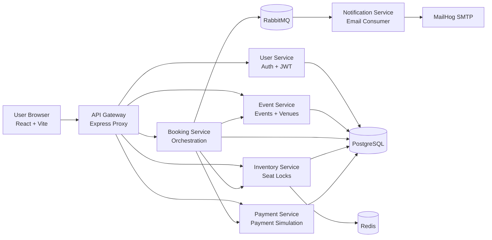
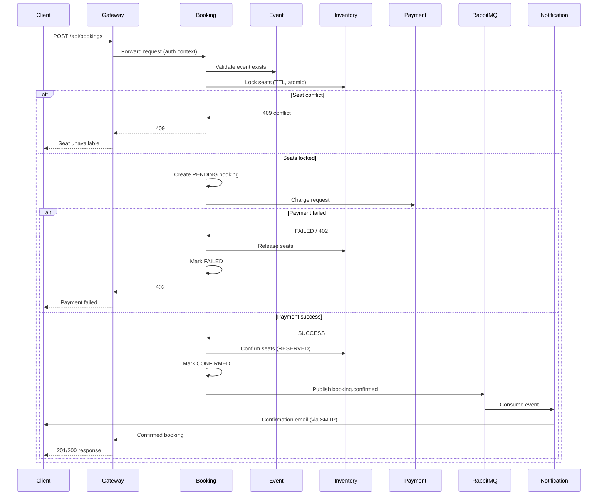

# FMS Monorepo

This repository contains TicketFlow, a distributed event ticketing platform built as a microservices system. It is designed to demonstrate real-world service decomposition, concurrency-safe seat allocation, asynchronous event-driven notifications, and an end-to-end booking experience across web and backend layers.

## Concept

TicketFlow solves a classic high-contention problem: many users trying to book the same seats at the same time.

The core design goals are:

- Prevent double booking under concurrent load.
- Keep services independently deployable and maintainable.
- Support synchronous request/response flows plus asynchronous domain events.
- Make local development reproducible with Docker + pnpm workspace tooling.

## Elevator Pitch

TicketFlow is a production-style ticket booking platform that combines:

- A React frontend for user-facing discovery and booking.
- An API gateway for routing, auth, and rate limiting.
- Specialized backend services for user, event, booking, inventory, payment, and notification domains.
- Redis-based atomic locking for race-condition-safe seat allocation.
- RabbitMQ-driven event publishing for decoupled notifications.

In short: it is a practical reference architecture for building resilient, scalable transaction workflows with microservices.

## System Architecture

### High-Level Diagram



### Booking Sequence (Critical Flow)



## Implementation Overview

### Monorepo Layout

- ticketflow/frontend: React + TypeScript + Vite UI.
- ticketflow/gateway: API gateway with route proxying and middleware.
- ticketflow/services/user-service: registration, login, JWT-based identity.
- ticketflow/services/event-service: event catalog, venues, seed data.
- ticketflow/services/booking-service: transaction orchestration and event publishing.
- ticketflow/services/inventory-service: seat availability and Redis lock management.
- ticketflow/services/payment-service: payment simulation with configurable success rate.
- ticketflow/services/notification-service: RabbitMQ consumer + email notifications.
- ticketflow/shared: shared middleware, event names, and common types.
- ticketflow/infra/postgres: database bootstrap SQL.

### Tech Stack

- Runtime: Node.js 20+ and TypeScript.
- Frontend: React 18, React Router, TanStack Query, Tailwind CSS, Vite.
- Backend: Express 4, Zod validation, JWT auth.
- Data access: Drizzle ORM with PostgreSQL.
- Concurrency/locking: Redis (SET NX EX).
- Async messaging: RabbitMQ topic exchange.
- Email testing: Nodemailer + MailHog.
- Tooling: pnpm workspaces, Jest, Docker Compose.

### Service Responsibilities

| Service              | Default Port | Primary Responsibility                                      |
| -------------------- | -----------: | ----------------------------------------------------------- |
| Gateway              |         3000 | Entry point, route proxying, rate limiting, auth middleware |
| User Service         |         3001 | User registration, login, profile identity                  |
| Event Service        |         3002 | Event listing/details, venue data                           |
| Booking Service      |         3003 | Booking orchestration and state transitions                 |
| Inventory Service    |         3004 | Seat retrieval, seat lock/release/confirm                   |
| Payment Service      |         3005 | Payment attempt recording and status result                 |
| Notification Service |         3006 | Consumes booking/payment events and sends mail              |

## Concurrency and Consistency Strategy

To avoid double-booking:

- Seat locks are attempted atomically in Redis using `SET key value EX ttl NX`.
- Locking is all-or-nothing for batch seat requests; partial locks are rolled back.
- Bookings transition through explicit status lifecycle: PENDING -> CONFIRMED or PENDING -> FAILED.
- On payment failure, lock release and booking failure update are part of the rollback path.
- Success events are published after booking confirmation write so consumers react to committed state.

## Local Development

### Prerequisites

- Node.js 20+
- pnpm 8+
- Docker + Docker Compose

### Setup

```bash
cd ticketflow
pnpm install
cp .env.example .env
docker compose -f docker-compose.dev.yml up -d
```

### Database Migrations

```bash
pnpm --filter user-service run migrate
pnpm --filter event-service run migrate
pnpm --filter booking-service run migrate
pnpm --filter inventory-service run migrate
pnpm --filter payment-service run migrate
```

### Seed Events

```bash
pnpm --filter event-service run seed
```

### Start the Platform

```bash
pnpm run dev:all
```

Backend only:

```bash
pnpm run dev:backend
```

## Environment Configuration

Main variables (see `ticketflow/.env.example` for the complete list):

- `JWT_SECRET`
- `USER_DB_URL`, `EVENT_DB_URL`, `BOOKING_DB_URL`, `INVENTORY_DB_URL`, `PAYMENT_DB_URL`
- `REDIS_URL`
- `RABBITMQ_URL`
- `PAYMENT_SUCCESS_RATE`
- `SMTP_HOST`, `SMTP_PORT`
- inter-service URLs (`*_SERVICE_URL`)

## API Surface (Gateway)

- `/api/users/*` -> user-service
- `/api/events/*` -> event-service
- `/api/bookings/*` -> booking-service
- `/api/inventory/*` -> inventory-service
- `/api/payments/*` -> payment-service

## Testing

```bash
pnpm run test
pnpm run test:integration
```

Single service example:

```bash
pnpm --filter booking-service run test
```

## Demo and Pitch Flow

For a live demo or stakeholder pitch, use this narrative:

1. Show event browsing in the frontend.
2. Authenticate a user and initiate a booking.
3. Trigger concurrent attempts for the same seat to show conflict safety.
4. Explain lock -> payment -> confirm orchestration and rollback handling.
5. Show asynchronous confirmation through RabbitMQ and MailHog inbox.
6. Highlight how each service can scale independently.

## Current Scope and Future Enhancements

Current scope:

- End-to-end booking flow with service boundaries and async notifications.
- Deterministic local infra for realistic development/testing.

Potential next steps:

- Add observability (distributed tracing, metrics dashboards).
- Add idempotency keys and outbox pattern for stronger delivery guarantees.
- Introduce payment provider adapters and retry policies.
- Add Kubernetes deployment manifests and CI/CD pipelines.

## Documentation Pointers

- Full setup and operation details: [INSTRUCTIONS.md](INSTRUCTIONS.md)
- TicketFlow-specific runtime notes: [ticketflow/README.md](ticketflow/README.md)
